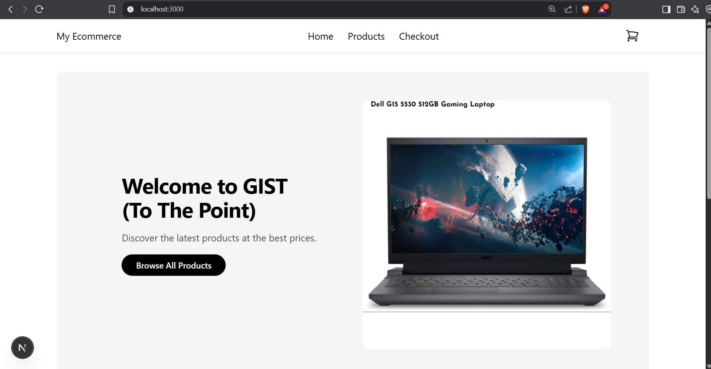
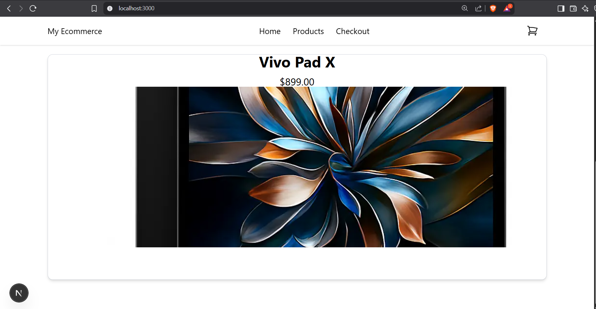
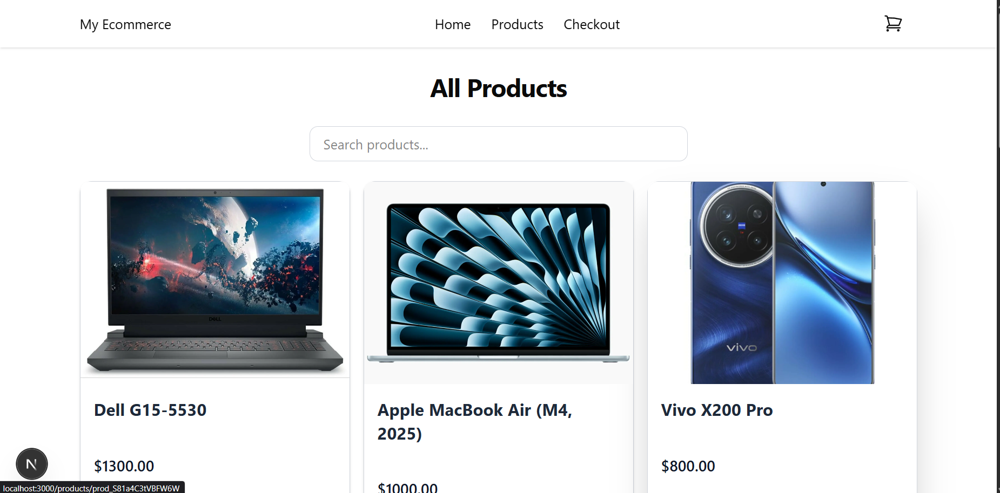
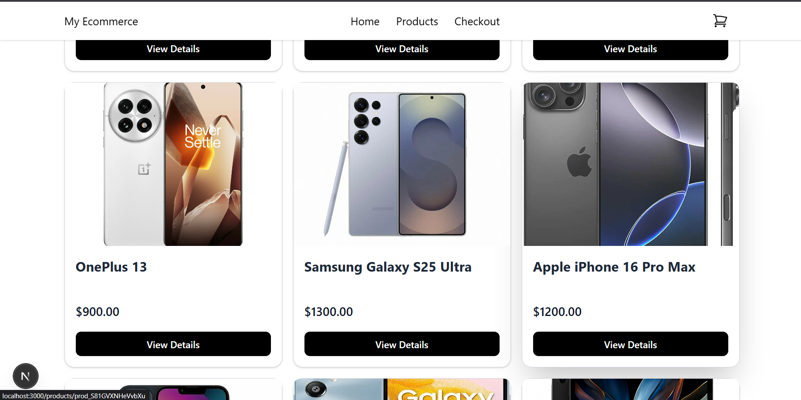
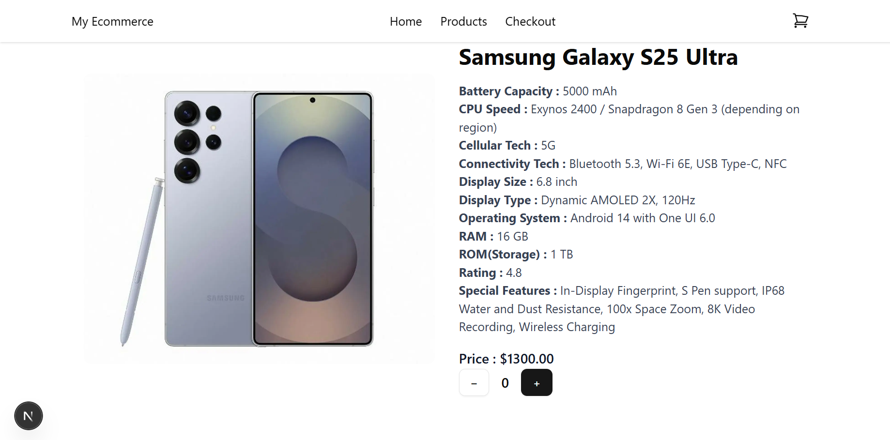
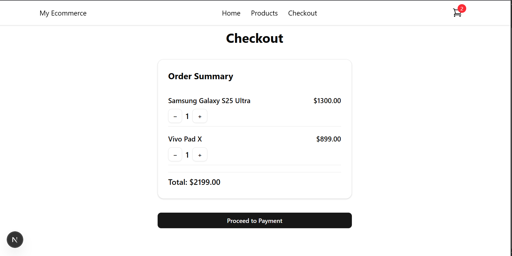
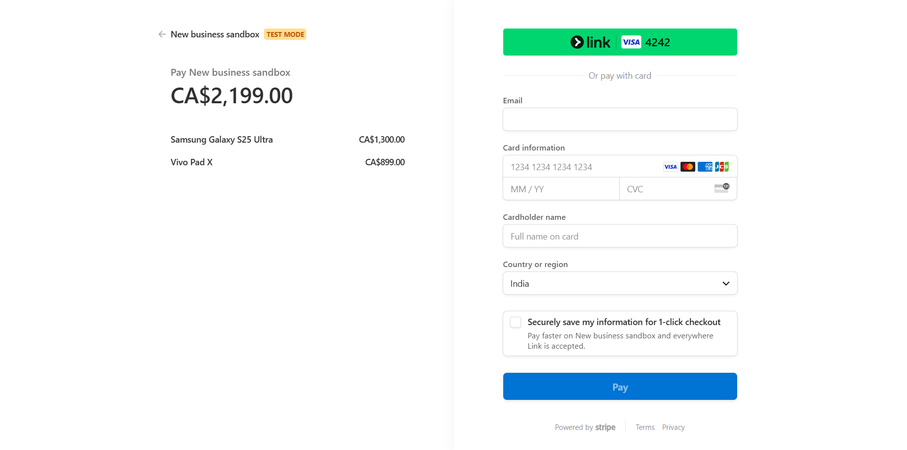
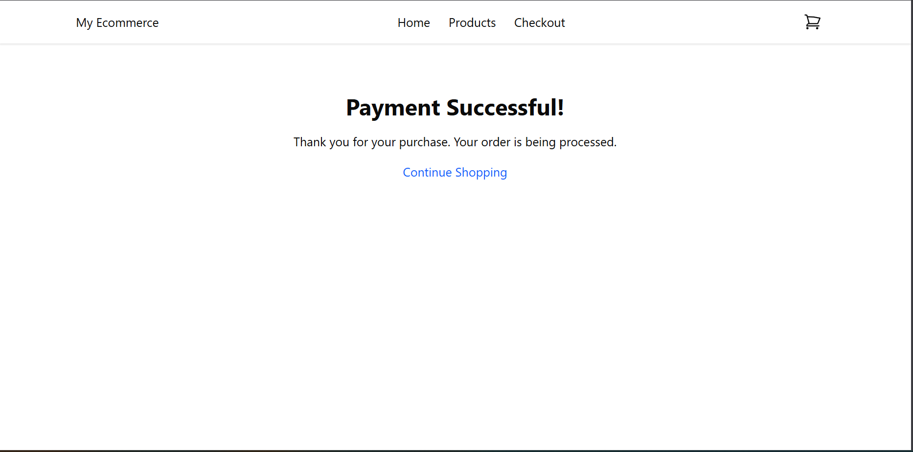

📦 Project: TheGist E-Commerce Website
📝 1) Project Info
A modern e-commerce website designed for simplicity and speed. Users can browse products, add items to their cart, and quickly checkout without creating an account or dealing with unnecessary steps.

⚙️ 2) How It Works
Visit the Website: Users land directly on the product page.

Browse Products: View available products with detailed information and images.

Add to Cart: Select desired products and add them to the cart.

Checkout: Complete payment securely using Stripe without creating an account.

Done: Simple, clean, and efficient e-commerce experience.

🛠️ 3) Tech Stack
Next.js — React framework for fast, server-rendered web apps.

TypeScript — Strongly typed JavaScript for safer, more reliable code.

Tailwind CSS — Utility-first CSS framework for responsive design.

Stripe API — Secure payment processing and product management.

Vercel — Hosting platform for deploying Next.js apps.

Zustand — Lightweight state management for React apps.


💳 Role of Stripe in This Project
Stripe is the core payment processor that powers the entire checkout and transaction system of this e-commerce website.

✅ What Stripe Enables:
Secure, Accountless Purchases:
Customers can make purchases directly using their card — no need to create a website account. Stripe handles secure payment processing, encryption, and transaction validation.

Built-in Checkout Pages:
Stripe’s hosted checkout securely collects payment details and confirms the transaction, reducing the need for a custom payment form on your website.

Transaction Records & Metadata:
Stripe records transaction data and supports custom metadata — like product details, quantity, and user-provided info — without needing user accounts.

🌐 Stripe Business Dashboard Features:
While this website keeps things account-free, if you use a Stripe business account, you can:

Send Emails Post-Purchase:
Request additional info like a shipping address, phone number, or feedback after payment.

Track Orders and Customers:
View complete transaction history, customer emails (collected during checkout), and payment statuses.

Add Metadata to Orders:
Include extra order info (like product IDs, quantities, user notes) in the payment metadata for processing and records.

Automate Receipts and Notifications:
Automatically send email confirmations and updates to users through Stripe.

🔒 Why This Is Great:
No Login Required:
Keeps the purchase flow minimal and fast.

Secure by Default:
Stripe handles PCI compliance, fraud detection, and encryption.

Optional for Expansion:
Businesses can later integrate address collection, email marketing, shipping management, and analytics through Stripe’s dashboard — without rebuilding the website.


## 📸 Screenshots

### Home Page


### Crousel


### Product List


### Product List


### Product Detail


### Add to Cart


### Checkout


### Order Confirmation



🗄️ Database Setup
1️⃣ Stripe (DEMO Mode)
Use Stripe Dashboard as a demo product catalog.

In the Products section, add new products.

Under More Options, add Metadata in the form of key-value pairs:
key : value (e.g., RAM : 8GB, Display : AMOLED).

Stripe will store this product and metadata, which can be fetched via Stripe’s API for display and processing on the website.

2️⃣ MongoDB
Create a MongoDB Atlas account.

Set up a new Database, then a Cluster, and inside it, create Collections to store order records, product references, or additional user data (if needed).

Use Mongoose (an ODM library) in your project to interact with MongoDB easily.

Don’t forget to set your MongoDB connection string in your .env file like this:
MONGODB_URI=your_mongo_connection_url


This is a [Next.js](https://nextjs.org) project bootstrapped with [`create-next-app`](https://nextjs.org/docs/app/api-reference/cli/create-next-app).

## Getting Started

First, run the development server:

```bash
npm run dev
# or
yarn dev
# or
pnpm dev
# or
bun dev
```

Open [http://localhost:3000](http://localhost:3000) with your browser to see the result.

You can start editing the page by modifying `app/page.tsx`. The page auto-updates as you edit the file.

This project uses [`next/font`](https://nextjs.org/docs/app/building-your-application/optimizing/fonts) to automatically optimize and load [Geist](https://vercel.com/font), a new font family for Vercel.

## Learn More

To learn more about Next.js, take a look at the following resources:

- [Next.js Documentation](https://nextjs.org/docs) - learn about Next.js features and API.
- [Learn Next.js](https://nextjs.org/learn) - an interactive Next.js tutorial.

You can check out [the Next.js GitHub repository](https://github.com/vercel/next.js) - your feedback and contributions are welcome!

## Deploy on Vercel

The easiest way to deploy your Next.js app is to use the [Vercel Platform](https://vercel.com/new?utm_medium=default-template&filter=next.js&utm_source=create-next-app&utm_campaign=create-next-app-readme) from the creators of Next.js.

Check out our [Next.js deployment documentation](https://nextjs.org/docs/app/building-your-application/deploying) for more details.
